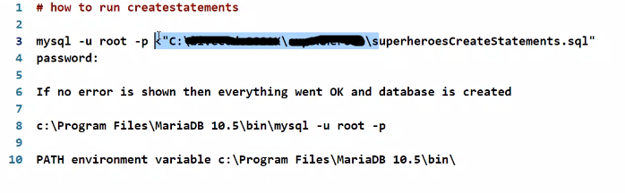

# how to run createstatements

mysql -u root -p '<'FULL PATH TO SQL FILE INCLUDING .SQL FILE // root || admin.

if no error is shown then everything went OK and DB is created

mysql -u WANTEDUSERNAME -p //mysql -u root -p

//if ! -> PATH environment variable: C:\Pogram Files\MariaDB 10.5\bin

mysql -u DBUSER -p '<'FULL PATH .sql // exec pre-written
